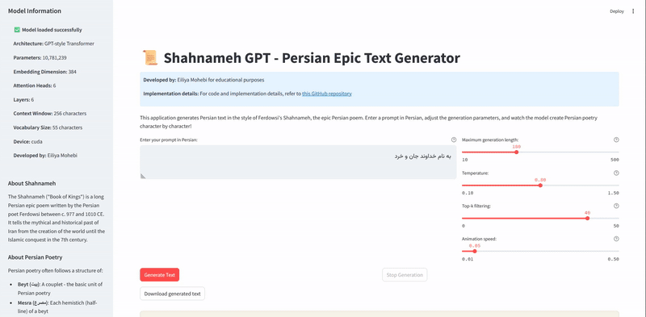

# Shahnameh GPT - Persian Poetry Generator

<div align="center">
  
  [](https://colab.research.google.com/github/eiliya-mohebi/shahnameh-text-generation-gpt-model/blob/master/shahname_gpt.ipynb)
  [](https://shahnameh-gpt-model.streamlit.app/)  
</div>

<div align="center">
  
</div>

## 📜 About The Project

Shahnameh GPT is a Persian language generation model trained on Ferdowsi's epic poem Shahnameh (شاهنامه - "The Book of Kings"). This project demonstrates how to train a GPT-style transformer model on classical Persian poetry and generate new text in that style.

## 🌟 Features

- Character-level tokenization for Persian text
- GPT architecture with transformers and self-attention
- Interactive text generation with adjustable parameters
- Right-to-left (RTL) text display with proper Persian formatting
- Token-by-token generation animation
- Live demo deployed on Streamlit

## 🚀 Live Demo

The model is deployed and accessible as a Streamlit web application:
[https://shahnameh-gpt-model.streamlit.app/](https://shahnameh-gpt-model.streamlit.app/)

## 🔬 Model Architecture

The model is a GPT-style transformer with:

- 6 transformer layers
- 6 attention heads per layer
- 384-dimensional embeddings
- Character-level tokenization
- Context window of 256 characters
- ~10.8 million parameters

## 🚀 Getting Started

### Prerequisites

- Python 3.7+
- PyTorch 1.8+
- Streamlit (for the demo app)

### Installation

1. Clone the repository
   ```bash
   git clone https://github.com/eiliya-mohebi/shahnameh-text-generation-gpt-model.git
   cd shahnameh-text-generation-gpt-model
   ```

2. Install required packages
   ```bash
   pip install -r requirements.txt
   ```

### Running the Notebook

The project includes a Jupyter notebook that walks through:
1. Loading and preprocessing the Shahnameh dataset
2. Building a tokenizer for Persian text
3. Creating the GPT model architecture
4. Training the model
5. Generating new Persian text

```bash
jupyter notebook shahname_gpt.ipynb
```
Also for full explanation of each section first refer to shakespeare-gpt.ipynb notebook.

## 📊 Dataset

The model is trained on the Shahnameh, the Persian epic poem written by Ferdowsi between 977 and 1010 CE. It consists of nearly 100,000 verses (or "couplets") of classical Persian poetry that tell the mythical and historical past of Iran from creation to the Islamic conquest.

Dataset structure:
- Chapter: Different sections of the epic
- Part: Subdivisions within chapters
- Bait: Couplets (verses)
- Mesra: Hemistichs (half-lines)
- Text: The actual Persian text

## 👏 Acknowledgments

- Ferdowsi, for creating the magnificent Shahnameh
- [Andrej Karpathy](https://github.com/karpathy) for his educational resources on building GPT models

## 📞 Contact

Eiliya Mohebi - eiliya.mohebi@gmail.com

Project Link: [https://github.com/eiliya-mohebi/shahnameh-text-generation-gpt-model](https://github.com/eiliya-mohebi/shahnameh-text-generation-gpt-model)

---

<p align="center">Developed by Eiliya Mohebi for educational purposes.</p>
